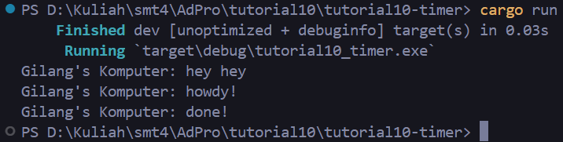
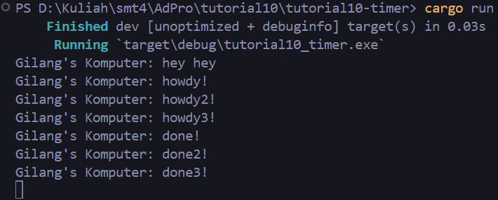
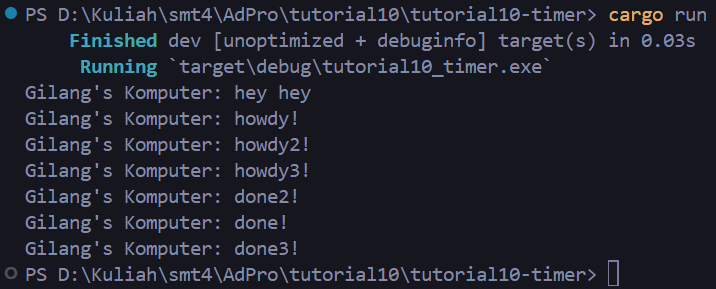

# Reflection

## 1.2. Understanding how it works.

If we take a look at `main()` in `main.rs`, an instance of TimerFuture is created and awaited within an async block that is passed to spawner.spawn(). This will print "Gilang's Komputer: howdy!", wait for 2 seconds, then print "Gilang's Komputer: done!". Meanwhile, the main thread will immediately print "Gilang's Komputer: hey hey" and then drop the spawner.

The drop(spawner) line is important because it ensures that the spawner and any tasks it may be running are properly cleaned up when they are no longer needed. This is a good practice in Rust to prevent memory leaks and other resource-related issues.

## 1.3. Multiple Spawn and removing drop
Without `drop(spawner)`

With `drop(spawner)`

When we don't add the `drop(spawner)` line, the program will not wait for the tasks to finish before exiting. This is because the spawner and tasks are not properly cleaned up when they are no longer needed. By adding the `drop(spawner)` line, we ensure that the spawner and tasks are properly cleaned up when they are no longer needed, which allows the program to wait for the tasks to finish before exiting.